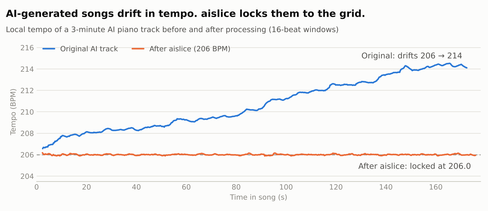

# aislice

[](https://github.com/VNL-Works/ai-music-slicer/actions/workflows/ci.yml)
[](https://pypi.org/project/aislice/)
[](https://github.com/VNL-Works/ai-music-slicer)
[](LICENSE)

Lock AI-generated music to a fixed BPM grid, then slice it by bar or beat.

AI music (Suno, Udio, …) rarely holds a steady tempo: it drifts across the song, so it never lines up with a DAW grid. `aislice` tracks every beat, builds a clean tempo map, and time-stretches the song in **one variable-ratio pass**, so every beat lands exactly on the target grid. Pitch is preserved. Then it cuts sample-accurate slices.

<picture>
  <source media="(prefers-color-scheme: dark)" srcset="docs/tempo-before-after-dark.png">
  
</picture>

> Status: v0.1.0, an early release. Feedback and issues are welcome.

## Install

Requirements: Python 3.10+, [ffmpeg](https://ffmpeg.org), and the [Rubber Band](https://breakfastquay.com/rubberband/) command-line tool.

```bash
# macOS
brew install ffmpeg rubberband
pip install aislice

# latest from GitHub
pip install git+https://github.com/VNL-Works/ai-music-slicer

# or, for development
git clone https://github.com/VNL-Works/ai-music-slicer && cd ai-music-slicer
pip install -e .
```

## Use

```bash
aislice song.mp3 other.wav          # asks for BPM and slice unit
aislice ./folder --bpm 206 --slice bar
```

Output (one folder per input):

```
aislice_output/song_206bpm/
├── song_206bpm.wav     # whole song locked to the grid (24-bit, source sample rate)
├── slices/             # song_bar_001.wav, song_bar_002.wav, ...
├── report.json         # detected tempo map, corrections, verification
└── tempo.png           # before/after plot
```

Slice units: `1/16`, `1/8`, `beat`, `bar`, `2bar`, `4bar`, `8bar`, any `Nbar` / `Nbeat` (e.g. `16bar`, `3beat`), or `none`.

### Fixing a wrong bar start

If slice 1 doesn't start on the "1", move the bar start without re-processing:

```bash
aislice reslice "aislice_output/song_206bpm" --shift 2      # bar 1 = 2 beats later
aislice reslice "aislice_output/song_206bpm" --slice 4bar,8bar
```

`aislice` prints a warning when it isn't sure where bar 1 is.

## How it works

1. **Analyze**: high-resolution onset envelope (~3 ms frames) and a local tempo curve, then a dynamic-programming beat tracker whose expected period follows the song's drift.
2. **Calibrate**: beat markers are aligned to the actual note attacks, so slices start just before each transient.
3. **Clean the tempo map**: fix missed and extra beats, ignore weak beats in fade-ins and fade-outs, and smooth out tracking jitter while keeping real drift. Then find the bar downbeat.
4. **Warp**: one Rubber Band R3 pass with a time map (source beat → target grid line), with the first downbeat placed on a bar line.
5. **Slice** at exact grid positions, then **verify** by re-tracking the output.

## Development

```bash
pip install -e ".[dev]"
pytest
```

The tests build synthetic songs with a known, drifting tempo and chords that change on each bar. That gives exact ground truth for beat timing, downbeat detection, slicing and the full end-to-end run. The end-to-end test needs `rubberband` and `ffmpeg` installed and is skipped otherwise. CI runs everything on Python 3.10–3.13. See [AGENTS.md](AGENTS.md) for architecture and invariants, and [CHANGELOG.md](CHANGELOG.md) for releases.

## License

[MIT](LICENSE) © VNL Works

`aislice` calls the [Rubber Band](https://breakfastquay.com/rubberband/) command-line tool as a separate program. Rubber Band itself is GPL-2.0+ (commercial licenses are available from its authors) and is installed separately.
